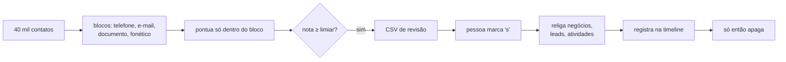

# bitrix24-contact-deduplicator

Encontra contatos duplicados no Bitrix24 comparando **quase nada** — e só
funde depois que uma pessoa aprovar.


---

## O problema

Base com 40 mil contatos. Comparar todos com todos são **800 milhões** de
comparações — inviável. E comparar por igualdade exata não acha nada, porque
duplicata real quase nunca é idêntica:

| Registro A | Registro B | Por que não bate |
|---|---|---|
| `João Gonçalves` | `Joao Goncalvez` | acento e `z`/`s` |
| `Ana Souza` | `Ana Sousa` | grafia do sobrenome |
| `+55 11 98765-4321` | `(11) 98765-4321` | máscara e DDI |
| `ANA@X.COM` | `ana@x.com` | caixa |

---

## Como resolve

**Blocking.** Cada contato entra em vários baldes baratos: cada telefone
(8 dígitos finais, ignorando DDI/DDD), cada e-mail, o documento e o **código
fonético do nome**. Só quem cai no mesmo balde é pontuado. O custo vira quase
linear e a recuperação continua alta, porque duplicata real quase sempre
compartilha pelo menos um desses sinais. Se o telefone foi digitado errado, o
e-mail ainda encontra.

**Código fonético adaptado ao português.** Soundex é inglês e não resolve
`Gonçalves`/`Goncalvez` nem `Xavier`/`Chavier`. Aqui os dígrafos caem
primeiro (`ch`→`x`, `lh`→`l`, `nh`→`n`), depois as sibilantes (`ç`, `ss`,
`sc`, `z` final → `s`), e as vogais no fim — que é onde mora a variação.
`Anna` e `Ana` colidem; `Silva` e `Souza` não.

**Pontuação com peso e justificativa.** Documento vale quase tudo; e-mail,
quase; telefone, metade; nome, pouco. Nome sozinho **nunca** chega ao limiar,
porque homônimo existe. Cada par sai com a lista de sinais que sustentam a
nota — quem revisa não aprova um número solto.



---

## Uso

Dois passos, de propósito. Não existe comando único que apague contato.

```bash
pip install -e ".[dev]"
cp .env.example .env

# 1) analisa e gera o CSV de revisão
dedup-contatos analisar --saida saida/duplicados.csv --limiar 0.75

# 2) abra o CSV, marque 's' na coluna 'aprovar', então:
dedup-contatos fundir --csv saida/duplicados.csv --executar
```

Saída da análise:

```
34 pares acima de 75% -> saida/duplicados.csv
  100%  manter #1042 João Gonçalves    | remover #2811 Joao Goncalvez   | mesmo CPF/CNPJ; mesmo e-mail
   82%  manter #900  Ana Souza         | remover #1533 Ana Sousa        | mesmo telefone; nome foneticamente igual
```

A coluna `aprovar` vem vazia. Esquecer de revisar não funde nada.

---

## Decisões técnicas

**Primeiro religar, depois apagar.** Negócios, leads, propostas e atividades
são movidos para o sobrevivente antes do `delete`. Se o robô morrer no meio,
o pior caso é uma duplicata órfã — que a próxima execução reencontra. Na
ordem inversa, o pior caso é um negócio sem contato nenhum, e nada no CRM
lembra a quem ele pertencia.

**Atividades vão junto.** É a parte que quase todo dedup esquece. Sem mover
ligações e e-mails, o histórico da conversa some com o duplicado, e o
vendedor liga para o cliente sem saber que falaram ontem.

**A fusão vira comentário na timeline.** Fusão não tem desfazer. Quem abrir o
contato daqui a seis meses e estranhar um telefone consegue descobrir de onde
ele veio, com a confiança e os sinais que motivaram a decisão.

**Sobrevivente é escolhido por critério determinístico.** Mais campos
preenchidos, depois mais antigo, depois menor ID. O desempate por ID parece
arbitrário e é justamente o ponto: rodar duas vezes na mesma base precisa dar
a mesma decisão, senão a revisão de ontem não vale hoje.

**Nunca sobrescreve dado existente.** O sobrevivente foi escolhido por ser o
mais completo, então o que ele já tem é a versão preferida. Do removido só
entram e-mails e telefones que faltavam.

**Bloco gigante é descartado.** Sessenta contatos com o telefone `00000000`
são erro de cadastro, não duplicata. Comparar ali dentro custa caro e não
acha nada.

---

## Testes

```bash
pytest -q
```

31 testes, focados em **precisão**: fundir dois contatos diferentes é
irreversível e destrói histórico; deixar uma duplicata passar custa uma
segunda rodada. Por isso há teste explícito para "dois sócios no mesmo
telefone corporativo não são a mesma pessoa" e para "homônimo não basta".

## Licença

MIT.
